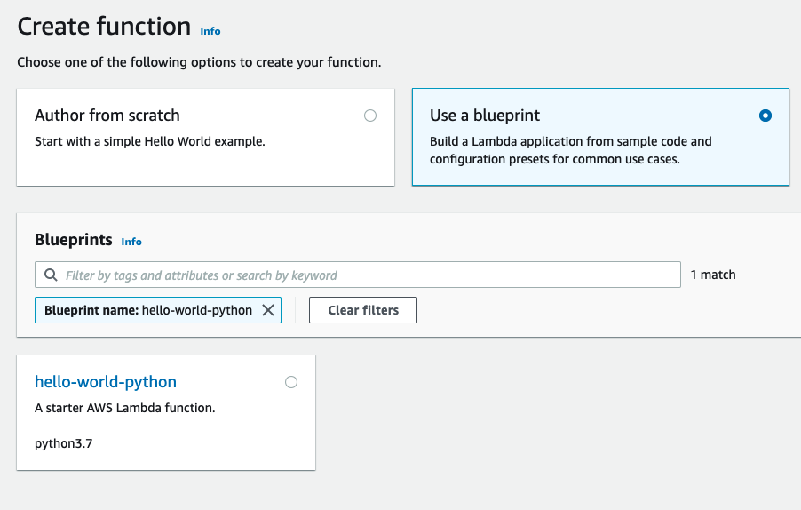
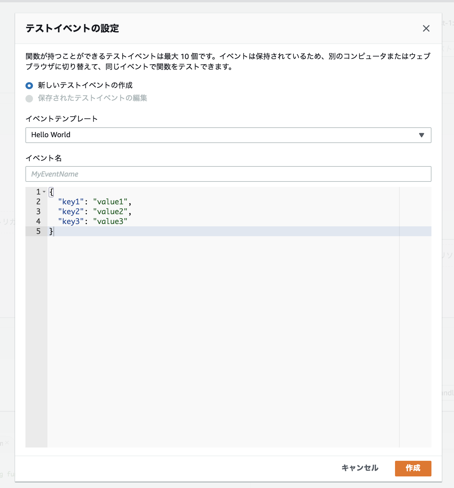
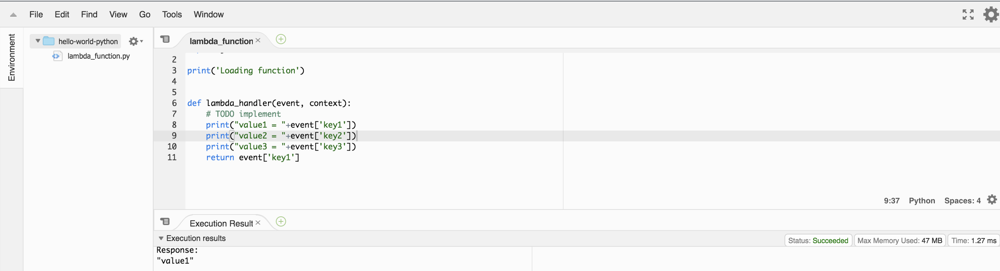
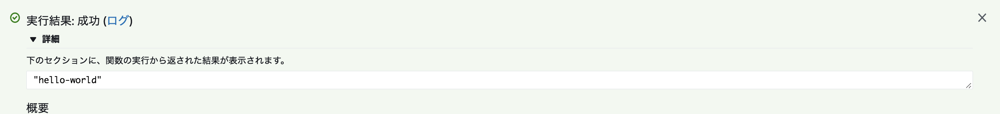
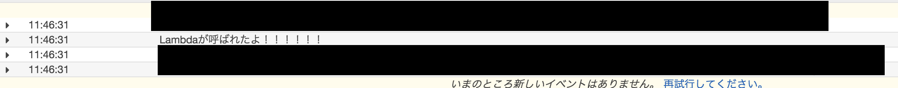

# what
- AWS Lambdaについて、調べたこと・実際にやったことをまとめる


# AWS Lambdaとは
- AWSが提供しているサーバーなしでプログラミングコードを実行するサービス
    - [公式ドキュメント](https://docs.aws.amazon.com/ja_jp/lambda/latest/dg/welcome.html)
- 利用できる言語は下記(2021時点)
    - Node.js
    - Java
    - C#
    - Go
    -  Python
    - Ruby
    - PowerShell
- Lambda関数というコードを利用することによってLambda上で処理を実行することができる
### Lambda関数とは
> 1 つ以上の Lambda 関数形式でアプリケーションコードを AWS Lambda (コンピューティングサービス) にアップロードします。代わりに、AWS Lambda は自動的にコードを実行します。AWS Lambda はサービスのプロビショニングおよび管理を行い、呼び出しによってコードを実行します。(AWS公式ドキュメントより)
- Lambda上で実行するコード事(=スクリプトみたいなもの)
- コンソール画面で作成したり、zipでアップロードしたもの、S3にあるコードをLambda関数として利用することができる
- [Lambda関数とは](https://www.techcrowd.jp/lambda/lambda%E9%96%A2%E6%95%B0/)

## Lambda上で処理が実行されるまでの流れ
こんな感じらしい
1. リクエストが来る
1. コンテナ(Linux)が立ちあがる
1. プログラミングコードの実行環境が立ち上がる
1. Lambdaプログラムが実行される
1. リクエストがなくなり10～20分程度でコンテナを終了する

# 実際にやってみる
### やってみること
- [AWS公式のチュートリアル](https://aws.amazon.com/jp/getting-started/tutorials/run-serverless-code/)
- [今度こそ理解する！俺式Lambda入門](https://dev.classmethod.jp/cloud/aws/lambda-my-first-step/)
    - S3での動作をトリガーとしてLambda関数を動かすという内容

## AWS公式のチュートリアル
※チュートリアルの内容が少々古いので、少し作業内容記載していきます

### Lambda関数を作成する
※ 関数名を決めて諸々設定していく(一部はチュートリアルに書いてある内容なので割愛している)

- 「Blueprints」を選択して関数を作っていく(2021時点、チュートリアルの「Blueprints」という項目は「Use a blueprint」に変更されている)
    - 

- 「関数コード」で出てくる用語について
    - ランタイム: 今回の関数で書く言語を選択する
    - ハンドラー: Lambda上でコードの実行を開始する場所のコードのメソッド/関数(ハンドラー)を指定する
        - 今回の話で上がっている「ハンドラー」は「`、アプリケーションにおいて処理要求に応じて呼び出されるモジュール`」の事
- 今回は、コードの中身を変更してみたりをやって、ロールなどについてはデフォルト設定でいく

### Lambda関数を呼び出して実行してみる
- 今回作成したLambda関数が動作するか確認する
- 「テスト」ボタンで今回確認するLambda関数をテストするためのサンプルデータを作り、テストできる状態にする
    -  ※「イベント名」は必須
    - 
- 作成したテストを選んで実行する
- 結果は、コンソール画面で確認できる
    - 
    - 


### メトリクスをモニタリングする
- Lambdaでは、Lambda関数が自動的にモニタリングされ、CloudWatchによってメトリクスがレポートされる仕組みになっている
    - コードの実行をモニタリングできるようにするため、メトリクスを発行する
    - メトリクス: 様々な活動を定量化し、その定量化したデータを管理に使えるように加工した指標のこと
        - ↑不安だったため、一応調べた
- 「メトリクス」タブでLambda関数のメトリクスを見ることができる
- 現時点で見られるのは下記
    - Invocations(呼び出し): 5分毎に関数が呼び出された関数
    - Duration(期間): 平均、最小、最大の実行時間
    - Error count and success rate(%): エラーの数と、エラー無しで完了した実行の割合
    - Throttles: 同時実行性元により失敗した実行回数
    - IteratorAge: ストリートイベントソースの場合は、Lambdaがそれを受け取って関数を呼び出したときのバッチ内の最後の項目の経過日数
    - Concurrent executions:関数の同時実行数

## 今度こそ理解する！俺式Lambda入門

### S3bucketを作成する
- 今回はAWSCliからbucketを作成してみる
    - 「lambda-s3-test」という名前のbucketで作成
- **lambda関数を作成するリージョンと同じリージョンで指定しないといけないので注意**

```zsh
aws --region ap-northeast-1 s3 mb s3://lambda-s3-test --profile [ユーザー名]
```

#### tips
- bucketを削除した後、すぐ同じ名前のbucketを作成しようとすると下記エラーが返ってくる
    - すぐに作れないのはS3側で削除の処理を行っている故らしい
```
make_bucket failed: s3:// lambda-test An error occurred (OperationAborted) when calling the CreateBucket operation: A conflicting conditional operation is currently in progress against this resource. Please try again.
```

### Lambda関数を作成する
- 公式チュートリアルとほぼ同じ方法で作成する
- トリガーにS3を設定して、先程の手順で作成したbucketを設定する
-


### トリガーを実行する
- s3にファイルを追加する
    - 今回はawscliを利用してファイルをアップロードする

```zsh
aws s3 cp test.txt s3://lambda-s3-test/targets/ --acl public-read --profile {ユーザー名}
```

### 実行の確認
- 今回作成したLambda関数が実行されるか確認する
- メトリクス画面の「ログ」を見て下記のような結果が出ていることを確認する
    - 


## 触ってみたわかったこと
- 難しそうかと思ったが、(コンソール画面で触る限りには)意外とやりやすかった
- Lambdaはあくまで「何をトリガーとして」処理を実行するもので、その「トリガー」自体を定期に実行する事はできない
- トリガーを定期実行するにはCloudWatch Eventsが利用できそうなので、次はそれを調べてみる

### 注意点
- Lambda自体の環境はpythonやrubyのスクリプトを実行する最低限なものしかなく、利用用途によってはライブラリやGemを追加する必要がある


# Lambdaの同期/非同期呼び出し
Lambdaは基本他のサービスからのイベントをトリガーとして実行されることが多いが、その際に「同期呼び出し」で実行される場合、「非同期呼び出し」で実行される場合の2種類がある

## 同期/非同期
### 同期呼び出し
直接Lambdaを1回実行するパターン。
例)
Lambda関数のテストを実行する際等

Lambdaが実行され処理が完了してからレスポンスが返ってくる。

### 非同期呼び出し
Lambdaを直接実行するわけではなく、キューイングされた後実行される。
Lambdaの呼び出しに失敗した場合は、自動的に2回までリトライされる(回数は設定で変更できる)
キューイングされたタイミングでレスポンスが返ってくる

## Lambda関数実行時にエラーが発生した場合の挙動
上記にも書いてはいるが、呼び出し方の違いによってLambda側で実行される内容が異なる

|呼び出し方法|Lambda関数実行中にエラーが発生した場合の動作|リクエスターの対応方法|
| --- | --- | --- |
| 同期 | エラー情報がリクエスターに戻される | 受け取ったエラー情報をハンドリングしリトライなどを組み込む |
| 非同期 |Lambdaがリトライ処理を自動的に最大2回実施する | デッドレターキューを作成し、リトライの2回目(処理と合わせると3回目)が失敗した場合のデータ受取先を構成する |

## 参考
[非同期呼び出し](https://docs.aws.amazon.com/ja_jp/lambda/latest/dg/invocation-async.html)
[エラー処理と AWS Lambda での自動再試行](https://docs.aws.amazon.com/ja_jp/lambda/latest/dg/invocation-retries.html)
[AWS Lambda関数を非同期で呼ぶ場合の動きを改めて確める](https://qiita.com/horit0123/items/295f8dc55d8c07e6512a)

