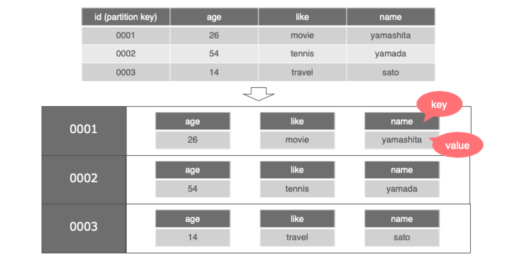
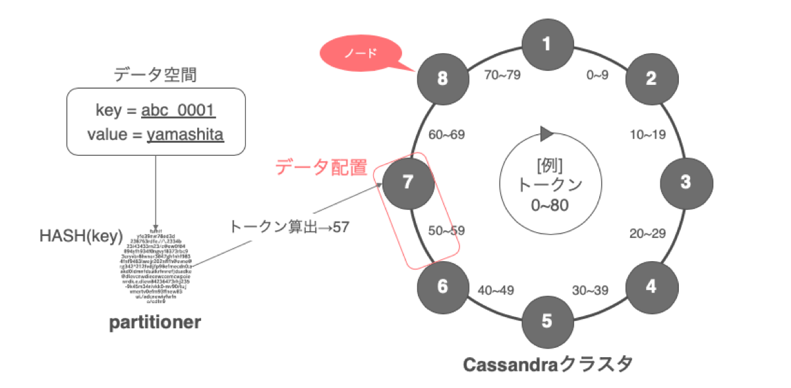

# what
- cassandaraについて基本的な概要や調べたことについて自分なりにまとめたもの
- 調べること
    - 基本概要
    - データが削除される際の仕組みについて

# cassandra(Apache Cassandra)とは
 - オープンソースのデータベース管理システム。
 - 「NoSQLのミドルウェア」という表現が正しい?
     - noSQL(DBに対する操作をする際にSQLを利用しない)
         - [【超入門】RDBとNoSQLの違いに着目！NoSQLに求めるものとは？](https://tech-blog.rakus.co.jp/entry/20180919/nosql/bigdata)
- ノードの構築や運用系の内容についてはjokerさんがesaにまとめている
    - [cassandraノードの構築と運用について](https://.esa.io/posts/14768)

## データモデル
データはkeyとvalueの組み合わせで構成されている。
ただし、単なる組み合わせではなく、valueに複数のカラムを持つwide-column store というものを採用している

**通常のkeyとvalueの組み合わせ**

|key|value|
| --- | --- |
|  |  |

**wide-column storeの場合の組み合わせ**
|key|Value_1|Value_2|Value_3|
| --- | --- | --- | --- |
|  |  |  |  |

ただし、cassandraは1レコードを上記図のように1行と認識するのではなく、1レコードをpartitionという括り(BQのパーティションと認識は同じ)にして、その中に複数のカラムがkey-valueで管理されている。
partitioneを区別するkeyのことをpartition keyと呼び、これをプライマリーキーとしてレコードを一位に識別する。

## データ配列の仕組み
クラスタ内に構成されている複数ノードを時計回りに配置してリングと見立て、リングを1周をハッシュトークン値で構成する。
各ノード(データの格納先)は担当するトークン範囲が決まっており、プライマリーキーの値をpartitionerと呼ばれる機構でハッシュ関数にかけてトークン値を算出し、その値によってどのノードにデータが配置されるかが決定される。
ノードは時計回りから見て自身とその手前のトークン範囲を担当する。

## データ削除の仕組み
RDSとは異なる方法でデータを削除する。
cassandraカラムのデータにはTTL(time to live)という有効期限を任意で持たせることができる。
設定した期間が経過すると、TTLデータにトゥームストーンと呼ばれるマーク(フラグ)を付与する。
(トゥームストーン...カラムが削除されたことを表す、行内のマーカー。マークが付いたカラムは削除される)
コンパクションと呼ばれる定期的に実行されるプロセスの際に、トゥームストーンのフラグの付いたカラムを削除する(**すぐに削除されるわけではない**)。
コンパクションが実行されるまではデータは残ったままであり、スキャンの対象になる。

# 参考資料
- [NoSQLデータベースCassandraの紹介 〜 ヤフーのデータ基盤を支える技術](https://techblog.yahoo.co.xn--jp-zia1035a/entry/20200129803067/)
- [データはどのようにして削除されるか](https://docs.datastax.com/ja/archived/cassandra/3.0/cassandra/dml/dmlAboutDeletes.html)
- [コンパクションの構成](https://docs.datastax.com/ja/archived/cassandra/3.0/cassandra/operations/opsConfigureCompaction.html?hl=%E3%82%B3%E3%83%B3%E3%83%91%E3%82%AF%E3%82%B7%E3%83%A7%E3%83%B3)
- [cassandraのDELETEの振る舞いについて](https://udomomo.hatenablog.com/entry/2018/05/08/092424)
