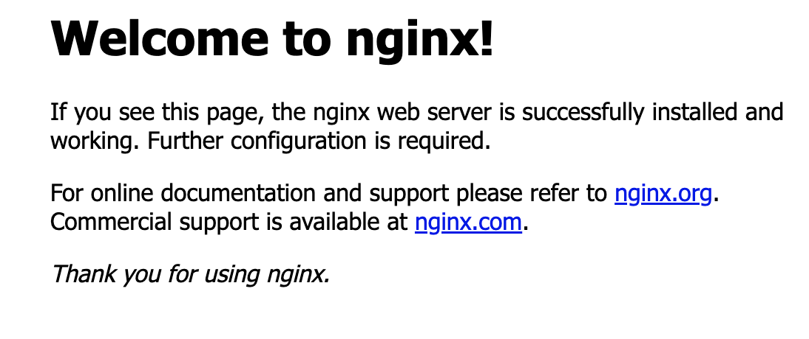

# コンテナ作成に慣れる

## いろいろなコンテナ
コンテナはソフトウェアの数だけ様々な種類が存在している。
今まではApacheのコンテナを作成したが、他のコンテナも作成して練習してみる。

### LinuxOSのコンテナ
LinuxOSのみのコンテナも色々と提供されている。
この場合は中に入って操作することが前提なので、引数で「シェルコマンド」を利用する

### Webサーバやデータベースサーバ用のコンテナ
Apacheの他にnginxもwebサーバ用のソフトウェアとして有名。
webサーバは通信することが前提なので、オプションでポート番号を指定する。
データベース管理ソフトウェアも、MySQLやPostgreSQLといったものも有名。
データベース管理ソフトの場合は、基本的にルートパスワードの指定が必要。

### プログラムの実行環境やその他のソフトウェア
プログラムを実行するには、その言語の「実行環境」が必要。
実行環境もコンテナとして提供されている。

例)
python
php
Ruby
等…

## Apacheのコンテナを複数作ってみる
練習の手始めとしてApacheのコンテナを複数作る。
複数作る場合は、`母体(ホスト)のポート番号が重複してはいけないので、1つずつずらす`。
コンテナ側のポート番号は、重複しても良いのですべて80で設定する。
(ブラウザでの確認も、それに伴い、アクセスするポートが変わる)

### runコマンドを実行する
Apacheのイメージ(https)から「apa000ex3」「apa000ex4」「apa000ex5」という名前のコンテナを作成・起動するコマンド文を入力する。
なお、ポート番号はそれぞれ「8081」「8082」「8083」とずらすように注意する。

```
$ docker run --name apa000ex3 -d -p 8081:80 httpd
6d542686282c118a0d17459a2fb34e331c0d368c740558084e431fcf1bd5941b

$ docker run --name apa000ex4 -d -p 8082:80 httpd
de782e9d13a508cece065713782a113dd6bee6409403b42886431d67248449e4

$ docker run --name apa000ex5 -d -p 8083:80 httpd
58fcc68bb602d0d1624ae307e89cfe7d6574068f329e4784c1e4e12979754af8
```

### psコマンドでコンテナの稼働を確認する
```
$ docker ps -a
CONTAINER ID   IMAGE     COMMAND              CREATED              STATUS              PORTS                  NAMES
58fcc68bb602   httpd     "httpd-foreground"   55 seconds ago       Up 54 seconds       0.0.0.0:8083->80/tcp   apa000ex5
de782e9d13a5   httpd     "httpd-foreground"   About a minute ago   Up About a minute   0.0.0.0:8082->80/tcp   apa000ex4
6d542686282c   httpd     "httpd-foreground"   About a minute ago   Up About a minute   0.0.0.0:8081->80/tcp   apa000ex3
```

### ブラウザでApacheにアクセスできることを確認する
`http://localhost:8081/` `http://localhost:8082/` `http://localhost:8083/`にそれぞれアクセスし、Apacheの初期画面を表示させる。

```
$ open http://localhost:8081/
$ open http://localhost:8082/
$ open http://localhost:8083/
```


### stopコマンドでコンテナを停止させる
```
$ docker stop apa000ex3
apa000ex3

$ docker stop apa000ex4
apa000ex4

$ docker stop apa000ex5
apa000ex5
```

### rmコマンドで、コンテナを削除する
```
$ docker rm apa000ex3
apa000ex3

$ docker rm apa000ex4
apa000ex4

$ docker rm apa000ex5
apa000ex5
```

### psコマンドに引数を付けて、コンテナの消去を確認する
```
$ docker ps -a
CONTAINER ID   IMAGE     COMMAND   CREATED   STATUS    PORTS     NAMES
```

## nginxのコンテナを作ってみる
次はnginxのコンテナを作ってみる。
nginx: Apacheと同じくWebサーバ機能を提供するソフトウェアで、最近大きくシェアを伸ばしている。
使い勝手や特徴は違うが、webサーバを提供するソフトウェアであることは同じのため、Apacheとほぼ同じ設定でコンテナを作成できる。

### runコマンドを実行する
nginxのイメージからコンテナを作成・起動する。
此処では、ポート番号を「8084」とする。

```
$ docker run --name nginx000ex6 -d -p 8084:80 nginx
Unable to find image 'nginx:latest' locally
latest: Pulling from library/nginx
1efc276f4ff9: Already exists
baf2da91597d: Pull complete
05396a986fd3: Pull complete
6a17c8e7063d: Pull complete
27e0d286aeab: Pull complete
b1349eea8fc5: Pull complete
Digest: sha256:790711e34858c9b0741edffef6ed3d8199d8faa33f2870dea5db70f16384df79
Status: Downloaded newer image for nginx:latest
2dc0a8076a59e440c40a3f3294fd058ac99e11a08854edea9ca8d3d999034b6c
```

### psコマンドでコンテナの稼働を確認する
```
$ docker ps
CONTAINER ID   IMAGE     COMMAND                  CREATED              STATUS              PORTS                  NAMES
2dc0a8076a59   nginx     "/docker-entrypoint.…"   About a minute ago   Up About a minute   0.0.0.0:8084->80/tcp   nginx000ex6
```

### ブラウザでnginxにアクセスできることを確認する
```
$ open http://localhost:8084/
```



### stopコマンドでコンテナを停止する
```
$ docker stop nginx000ex6
nginx000ex6
```

### rmコマンドでコンテナを削除する
```
$ docker rm nginx000ex6
nginx000ex6
```

### コンテナの消去を確認する
```
$ docker ps -a
CONTAINER ID   IMAGE     COMMAND   CREATED   STATUS    PORTS     NAMES
```

## MySQLのコンテナを作ってみる
