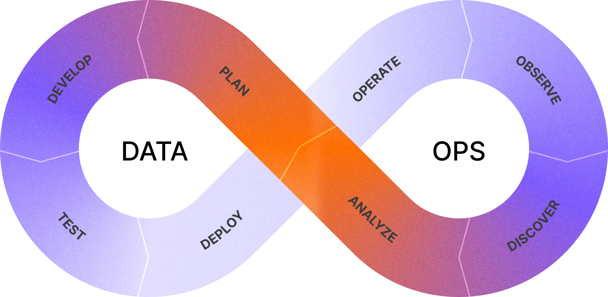

# what

- dbt Labsが提唱する「Analytics Development Lifecycle(ADLC)」について調べてみたことやわかったことの個人ログ

## 記載しないこと

- DMBOKピラミッドの詳細

# Analytics Development Lifecycle（ADLC）とは？

※ 日本語にすると「開発分析ライフサイクル」となる?
https://www.getdbt.com/resources/the-analytics-development-lifecycle

組織がデータ分析をより良く、より効率的に行うためのやり方。(PDCAサイクルとかそういったものに似ているかも?)
データ分析システム全体をソフトウェアとして捉え、ソフトウェア開発の考え方をデータ分析に持ち込んだものとなっている。

データマネジメントや活用に於いてのアプローチといえば「[DMBOKピラミッド](https://community.sap.com/t5/human-capital-management-blog-posts-by-sap/why-hr-data-management-strategy-is-important-in-your-hr-transformation/ba-p/13469355)」があるが、ADLCはこれとはまた違った目的やアプローチの方法になる。

|  | 定義 | 目的 | 焦点の範囲 |
| --- | --- | --- | --- |
| DMBOKピラミッド | 組織がデータを適切に管理し、信頼姓を担保するためのアプローチ | 組織が信頼性の高いデータをモチ、適切なプロセスを通じて戦略的なビジネス目標をサポートできる状態を目指す。(データ品質の改善等) | データの管理と信頼性。データが正確で、適切にガバナンスされている状態を目指す |
| ADLC | 組織があらゆる規模で成熟した分析実績を構築するため、データの生成や分析のサイクルを早め、データ・分析の品質を向上させるためのワークフロー | データの信頼性低下や意思決定の速度・質の低下という問題に対し、組織におけるデータ活用を高め、質の高い意思決定をできるように支援する事 | データマネジメントが提供するデータを利用して、そこから価値を引き出すことを目指す |

そのため、双方の立ち位置としては以下になる(ハズ)

- データの整備→DMBOKピラミッド
- データ活用や価値を見出す→ADLC

# ADLCの特徴

## ソフトウェア開発の要素をデータ分析に取り入れる

ADLCはソフトウェア開発の要素を取り入れたアプローチ手法のため、その開発工程である「バージョン管理」「テスト」「統合・デプロイ」をデータ分析・活用の中に入れている。

## データの信頼性向上と迅速な意思決定を目的とする

データに対する信頼性の低下、意思決定の遅延等といった課題についてデータ活用のサイクルを早めながら、データ分析の練度を上げることを目指す。

## 幅広い領域に適用される

ADLCではは、データ変換という狭い領域に限定されず、データの取り込みから変換、分析そしてアプリケーションの開発に至るまでの「分析システム全体の構築」に適用される。

## 関係者全員が共通するワークフローを利用する

通常であれば、データアナリスト、データエンジニア、意思決定者…とそれぞれ立場や領域が異なるメンバーがそれぞれの役割を担っている。

しかし、ADLCではメンバーが状況に応じて様々な役割を柔軟に切り替えられることを理想としている。そして、それを実行できるようにADLCでは共通のワークフローが設定されている。

# 共通の枠組み・ワークフローについて

ADLCにおけるワークフローは次の8ステージで構成されている。これをループしながらデータ活用や価値を見出していく。

## 1. Plan(計画)

- 変更内容の変更と計画を立てる
- ビジネスケースの作成や実装計画、メンテナンス計画等がここに含まれる

## 2. Develop(開発)

- 計画に基づきコードを書く
- 複数のメンバー間で読めるコードを書くことが推奨
- ReviewやApproveも複数のメンバー間で実施される必要がある

## 3. Test(テスト)

- 変更が意図通りに機能するかを確認する
- テストは共通の期待値や説明責任に関わるののため、本番環境にデプロイされる前にかならずテストを実行すること
- ユニットテスト、データテスト、統合テストの３種類のテストが実行されるのが理想

## 4. Deploy(デプロイ)

- コードを本番環境に適用する
- ここでは、デプロイが自動で行われているのが理想(とは書かれている。ソフトウェア開発に基づいているからだろうか)

## 5. Operate(運用)

- システムが安定して稼働していることを確認する
    - デプロイで追加・変更したもの等

## 6. Observe(監視)

- システムのパフォーマンスやエラーを監視し、問題があれば検知・解決する
- エラーを迅速に発見し、エラー検出から解決までの時間を短縮することが重要になる
- 可用性、レイテンシー、スループット等の指標を利用し、継続的に監視できる状態を作ることを目指す

## 7. Discover(発見)

- 開発によって得られた成果物(データ資産)を見つけ出す
- システムであれば、利用者やその傾向等からどのような情報を得られるか、どんな情報が必要になるかを調査する

## 8. Analyze(分析)

- データ資産を分析し、それが価値となるものかを判断する
- レポートやダッシュボードでデータの分析を行い、それが「価値のあるものか」「次のサイクルにつながるか」といった判断を行う
- 「正しい」「間違っている」の判断、というよりは「次のサイクルにおいて、どのようなシステム・活用をしていくか」という要件を探していくフェーズå

# どんなメリットがあるのか?

ソフトウェア開発の手法を取り入れている事もあり、次のようなメリットがあるとされる。

## 意思決定の速度向上

- ADLCはデータの活動速度を上げるように設定されている
- 大規模な変更を小さな単位に分割して開発プロセスを進めることで、より迅速なサイクルを回すことができる

## システム運用の改善と可視性の向上

- 障害への耐性と迅速な復旧を目指し、システムが障害から復旧する時間を短縮することができるようになる

## 監視可能性と保守性の向上

- 開発にコード品質の向上や、運用における継続的な観測等を目指すことで、データのみならずシステム自体の質の向上にもつなげることができる